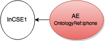
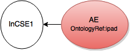
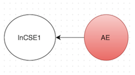

# onem2m-client-core (Version 2.0.1)

[Iotdm (Internet of Thing Data Management)](https://wiki.opendaylight.org/view/IoTDM:Main) is data-centric server or middleware that will act as a oneM2M compliant IoT Data Broker (IOTDM) and enable authorized applications to retrieve IoT data uploaded by any device.  

 OneM2M message can be carried by different protocols. The binding documents(TS-0004,TS-0008,TS-0009,TS-0010) show the specific binding between protocls message and OneM2M message. A summary can be found [here](https://wiki.opendaylight.org/images/9/93/API_Calls_Examples.pdf).

This project aims to provide a oneM2M-layer client that encapsulate all the complexity of protocol-to-oneM2M binding. The API of this layer is based on data model (Java classes) generated from OneM2M **short-version** XSD. It can be used for application-layer oneM2M client development.

##Pre-Requirement
Maven version: 3.3+  
Java versison: 1.8+     
Onem2m xsd short-version:2.2.0

##Set up 
Download the project, and at the root of project:

```bash
mvn clean install
```

##Restconf
***Restconf*** class aims to provide admin http access to Iotdm.

##Client API
***Client interface*** is for implementation of OneM2M Client in different protocols(Http, Coap, Mqtt). 

```java
public interface Client {
    public void start();
    public void stop();
    public void send(Exchange iotdmExchange);
}
```

Currently, implementation of HTTP and Coap are provided.

##Port
Iotdm Http port:8282 (Maybe changed in future)
Iotdm Coap port:5683 (Maybe changed in future)
Iotdm Restconf:8181 (Maybe changed in future)

##Data Model
***Data model*** is generated based on OneM2M XSD file, which is mainly for content carry and exchange. 

All data model Java classes are list below:

| | |
--- | --- 
AE.java|                    FilterCriteria.java|
AEAnnc.java|                Firmware.java|
AccessControlPolicy.java|       FirmwareAnnc.java|
AccessControlPolicyAnnc.java|       Group.java|
AccessControlRule.java|         GroupAnnc.java|
ActionStatus.java|          LocationPolicy.java|
ActiveCmdhPolicy.java|          LocationPolicyAnnc.java|
AggregatedNotification.java|        LocationRegion.java|
AggregatedRequest.java|         M2MServiceSubscriptionProfile.java|
AggregatedResponse.java|            Memory.java|
AnnounceableResource.java|      MemoryAnnc.java|
AnnounceableSubordinateResource.java|   MetaInformation.java|
AnnouncedMgmtResource.java|     MgmtCmd.java|
AnnouncedResource.java|         MgmtLinkRef.java|
AnnouncedSubordinateResource.java|  MgmtResource.java|
AnyArgType.java|                Node.java|
AreaNwkDeviceInfo.java|         NodeAnnc.java|
AreaNwkDeviceInfoAnnc.java|     Notification.java|
AreaNwkInfo.java|           ObjectFactory.java|
AreaNwkInfoAnnc.java|           OperationResult.java|
Attribute.java|             PollingChannel.java|
AttributeList.java|         PrimitiveContent.java|
BatchNotify.java|           RateLimit.java|
Battery.java|               Reboot.java|
BatteryAnnc.java|           RebootAnnc.java|
CSEBase.java|               RebootArgsType.java|
ChildResourceRef.java|          RegularResource.java|
CmdhBuffer.java|                RemoteCSE.java|
CmdhDefEcValue.java|            RemoteCSEAnnc.java|
CmdhDefaults.java|          Request.java|
CmdhEcDefParamValues.java|      RequestPrimitive.java|
CmdhLimits.java|                ResetArgsType.java|
CmdhNetworkAccessRules.java|        Resource.java|
CmdhNwAccessRule.java|          ResourceWrapper.java|
CmdhPolicy.java|                ResponsePrimitive.java|
Container.java|             ResponseTypeInfo.java|
ContainerAnnc.java|         Schedule.java|
ContentInstance.java|           ScheduleAnnc.java|
ContentInstanceAnnc.java|       ScheduleEntries.java|
Delivery.java|              ServiceSubscribedAppRule.java|
DeliveryMetaData.java|          ServiceSubscribedNode.java|
DeviceCapability.java|          SetOfAcrs.java|
DeviceCapabilityAnnc.java|      Software.java|
DeviceInfo.java|                SoftwareAnnc.java|
DeviceInfoAnnc.java|            SoftwareInstallArgsType.java|
DownloadArgsType.java|          SoftwareUninstallArgsType.java|
EventConfig.java|           SoftwareUpdateArgsType.java|
EventLog.java|              StatsCollect.java|
EventLogAnnc.java|          StatsConfig.java|
EventNotificationCriteria.java|     Subscription.java|
ExecInstance.java|          UploadArgsType.java|
ExecReqArgsListType.java|       package-info.java|


##Json Serialization and Deserialization
Since Onem2m requires Onem2m-compliant json format. A json utility is provided to meet this requirement. 

For serialization:

```java
    public void aE_serialization(){
        Ae ae=new Ae();
        ae.setOr("iphone");
        String str=Json.newInstance().toJson(ae);
        //{"or":"iphone"}
    }
    
    public void aE_derialization(){
        String str="{\"or\":\"iphone\"}";
        Ae ae=Json.newInstance().fromJson(str,Ae.class);
        //ae.getOr() is "iphone"
    }
```

To delete attribute in a resource.

```java
    public void aE_attribute_delete_serialization(){
        Ae ae=new Ae();
        ae.setOr(Json.STRING_NULL);
        String str=Json.newInstance().toJson(ae);
        //{"or":null}
    }
```


##Step-by-Step Example
####Provision Tree
Provisioning the tree means create the root of resource tree in the Iotdm server.This operation needs admin access permission. So it is only accessed through Restconf. 
 
```java
public static void setUp() {
	RestConf.defaultProvision();
}
```

This example use default setting for provisioning that create root resource named as InCSE1. The type of root is CSEBase.  

   
####Create AE under root
```java
public void createAE(){
		 Client client = new Http();
		 //For coap, please uncomment code below
       //Client client=new Coap();
        Request request = new Request()
                .to("InCSE1")
                .operation(OneM2M.Operation.CREATE)
                .resourceType(OneM2M.ResourceType.AE)
                .from("localhost")
                .requestIdentifier("1234")
                .name("AE");
       

       //For Http
       //request.port(8282); 
       
       //For coap
       //request.port(5683);
       
		//Add the data want to create
        Ae ae = new Ae();
        ae.setOr("iphone");
        ae.setRr(true);
        ae.setApi("12345");

        request.addPrimitiveContent(ae);

        client.start();
        Response response=client.send(request);
        client.stop();
}
```



####Update AE
```java
public void update(){
        Client client = new Http();
        //For coap, please uncomment code below
        //Client client=new Coap();
        Request request = new Request()
                .to("InCSE1/AE")
                .operation(OneM2M.Operation.UPDATE)
                .from("localhost")
                .requestIdentifier("1234");
		
		 //For Http
       //request.port(8282); 
       
       //For coap
       //request.port(5683);
       
		//Add the data want to update
        Ae ae = new Ae();
        ae.setOr("ipad");

        request.addPrimitiveContent(ae);

        client.start();
        Response response=client.send(request);
        client.stop();
}
```
If a attribute in Ae needed to be deleted. The Onem2m standard require this attribute in json payload should be null. Since java's null mean nothing rather than delete, a supplementary mechanism for null is provided by this Client.




####Retrieve AE 
```java
public void retrieve(){
        Client client = new Http();
        //For coap, please uncomment code below
        //Client client=new Coap();
        Request request = new Request()
                .to("InCSE1/AE")
                .operation(OneM2M.Operation.RETRIEVE)
                .from("localhost")
                .requestIdentifier("1234");

       //For Http
       //request.port(8282); 
       
       //For coap
       //request.port(5683);
       
        client.start();
        Response response=client.send(request);
        client.stop();    
}
```

####Delete or attribute in Ae

```java
public void update(){
        Client client = new Http();
        //For coap, please uncomment code below
        //Client client=new Coap();
        Request request = new Request()
                .to("InCSE1/AE")
                .operation(OneM2M.Operation.UPDATE)
                .from("localhost")
                .requestIdentifier("1234");
		
		 //For Http
       //request.port(8282); 
       
       //For coap
       //request.port(5683);
       
		//Add the data want to update
        Ae ae = new Ae();
        
        //Json.STRING_NULL let serialized Json has null value
        ae.setOr(Json.STRING_NULL);

        request.addPrimitiveContent(ae);

        client.start();
        Response response=client.send(request);
        client.stop();
}
```

####Delete AE
```java
public void delete(){
        Client client = new Http();
        //For coap, please uncomment code below
       //Client client=new Coap();
        Request request = new Request()
                .to("InCSE1/AE")
                .operation(OneM2M.Operation.DELETE)
                .from("localhost")
                .requestIdentifier("1234");

       //For Http
       //request.port(8282); 
       
       //For coap
       //request.port(5683);
       
        client.start();
        Response response=client.send(request);
        client.stop();
}
```


###Clean the tree 
```java
public static void tearDown() {
        RestConf.defaultClear();
}
```


##Unrealized function
Unblocking request is not supported.(Non-blocking-request-synchronized and non-blocking-request-asynch will be supported once OneM2M standard become explicit.
)

Notification and Subscription is not supported.

Http unsupported item:
(1) Partial retrieve is still unclear in the TS-00004.
(2) Etag

Coap unsupported item:
(1) Usage of Blockwise Transfers
(2) Paritial retrieve
(3) Freshness

##Resource
[Short name to long name script](http://member.onem2m.org/Application/documentApp/documentinfo/?documentId=13134&fromList=Y)


##Update Log
###Version 2.0.1
* Split the IotdmExchange class into Request and Response class
* Change the Client api by using new Class Request and Response

###Version 2.0.0
* Client based on short-name xsd of version 2.2.0 of onem2m standard.
* Coap added 
* New tool for onem2m-specific Json serilization and deserialzation
* New restconf class
* Align code with TS-0004(version 2.2.0), TS-0008(version 1.2.0) and TS-0009(version 2.1.0)
* Compatible with Java 8+

###Version 1.0.0 
* First version for onem2m client based on xsd of version 1.2.0 of Onem2m standand.
* Support http protocle as commnication vehicle. 
* Run on the JRE 7


